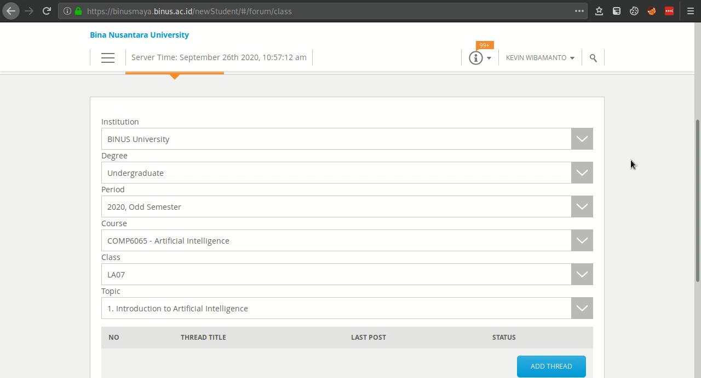
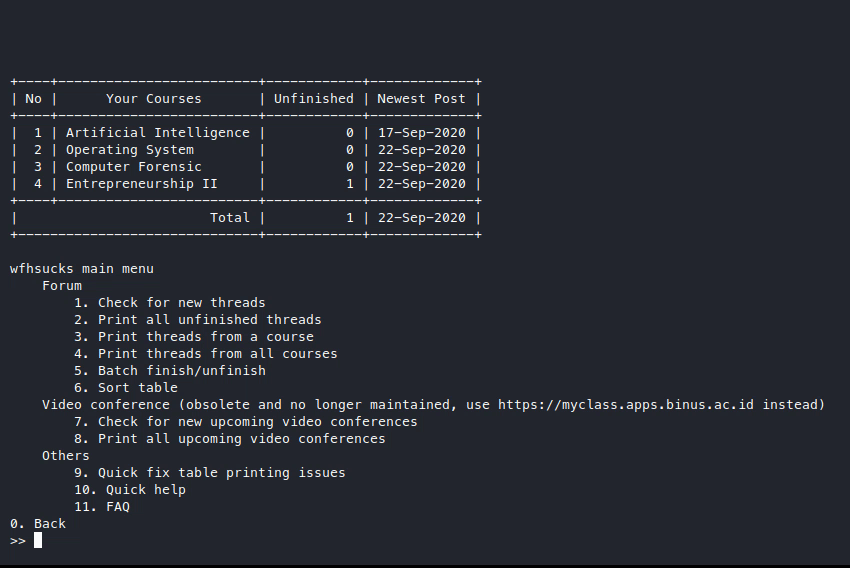
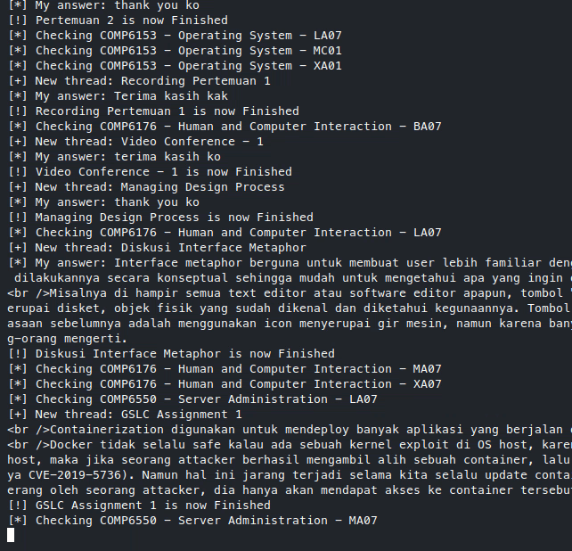
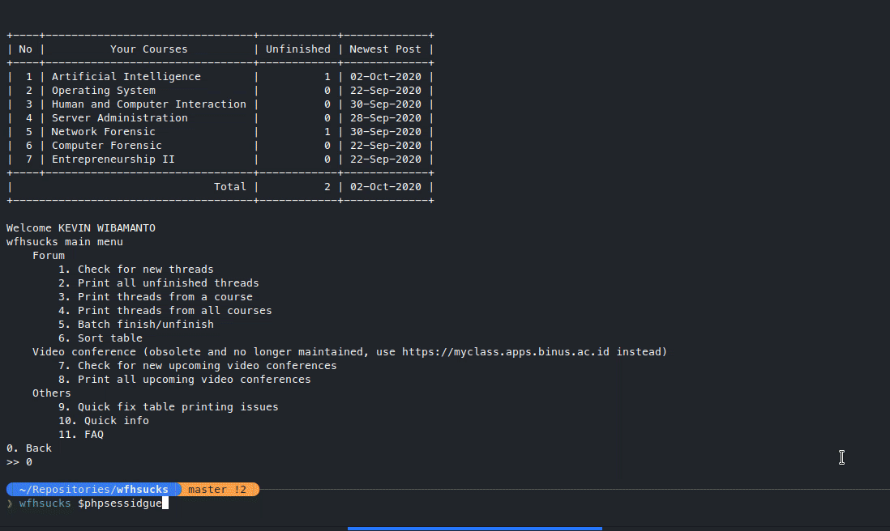

# wfhsucks

Binusmaya forum grabber and journal

Tired of bimay's forum interface? 
Lot's of repetitive clicking?
Can't remember which forums tasks and discussions you've done?
This looks familiar?

Well how about a script that solves all that?
All the forums are fetched automatically with 1 button press.
Only essential data is loaded, which means more speed!
No need to load already loaded data as it is saved locally, more speed and "offline" access!
Keeping track of replying to forums is much easier with a "todo list" style of approach.

Starting to use this tool in the middle of a semester? That's alright, the script automatically detects whether you've replied to a forum or not, so you don't have to do any manual work on the journal.

Want to reply to a forum fast but don't want to go into bimay? That's alright, you can reply directly from this script. The input is also simple, just pick the thread you want to reply, type in your reply title, type in your reply content, and there you go.

Note that the reply feature is designed for short replies (for attendance), for multiline content, you'll have to replace "enter" with ` `, because "enter" is reserved for finishing the reply.

### why did I make this

wfhsucks if a "program" i made to help me deal with stuff like
- checking all forum for new threads easily
- checking all courses for new video conference schedules
- finishing all my forum assignments
- not having to deal with bimay's loading speed
- not missing video conferences

using it alone feels like a waste tho, so here ya go, hope it helps
stay safe

any improvements are welcome

### known bugs
- vidconfs are not grabbed if the course code isn't available from forum data.

### upcoming features
- multithreading
- option to delete vc that have already passed
- support for forum attachments
- 'last updated' in overview
- upcoming vidconf shown in overview
- forum overview only shows courses with non 0 unfinished threads
